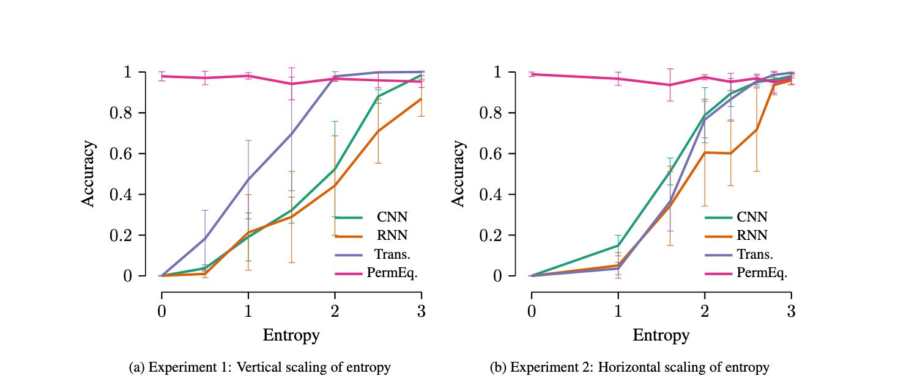

<h1 align="center">Systematic Generalization in Language Models Scales with Information
Entropy</h1>

  <b>Sondre Wold, Lucas Georges Gabriel Charpentier, Étienne Simon </b>

  <i>
    Language Technology Group, University of Oslo 
  </i>
   

 

  <a href=""><b>Paper</b></a> 

    

  <!-- Container to align the image and the caption -->
  

    
    <!-- Caption below the image -->
    

    

  

